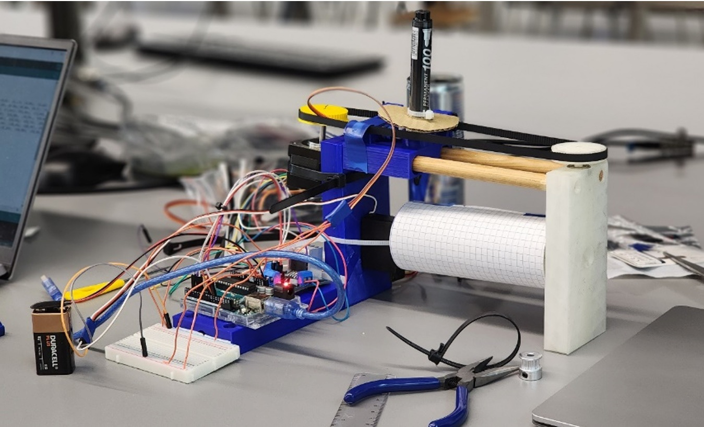
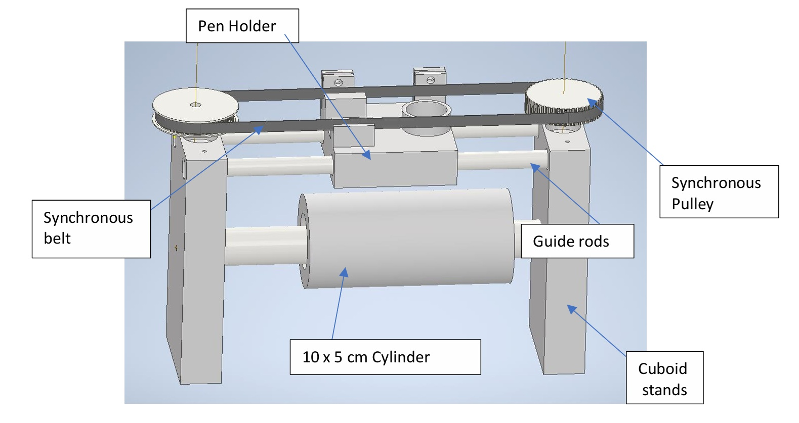
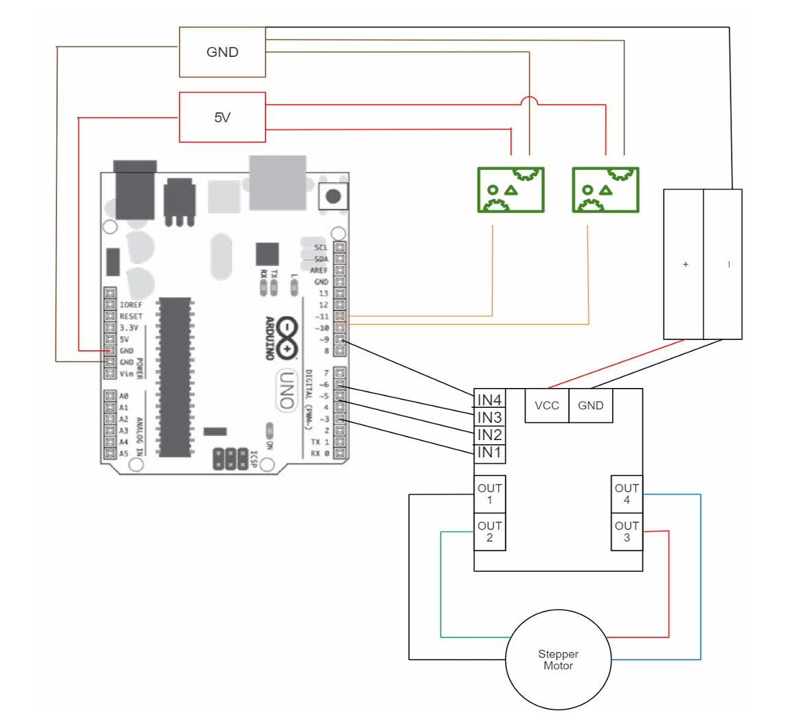
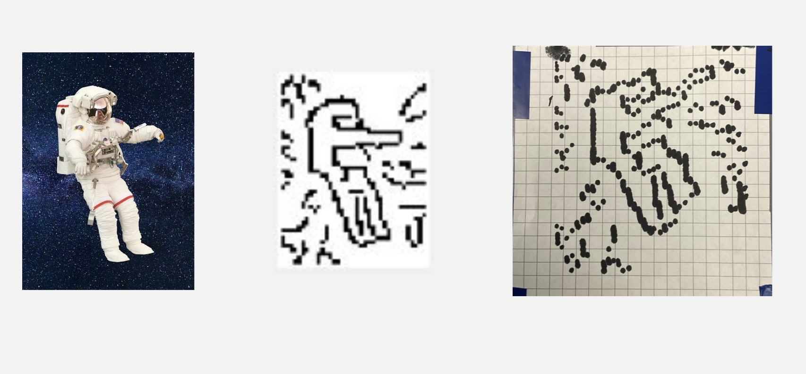

# 2D Image Printer Robot

## Overview
This project presents the design and implementation of a robotic system capable of drawing a 2D image onto the curved surface of a cylinder. Inspired by the operating principles of dot matrix printers, the robot integrates mechanical design, image processing, and embedded motor control to convert a digital image into a physical drawing.

The system demonstrates an end-to-end engineering workflow, from concept and kinematic modeling to hardware prototyping, control implementation, and experimental validation.

---

## Project Highlights
- Image-to-motion pipeline using MATLAB and Arduino  
- Drawing on a non-planar (cylindrical) surface  
- Belt-driven linear motion with synchronized rotation  
- Budget-constrained physical prototype  
- Full system integration: mechanical, electrical, and software  

---

## System Architecture

### Mechanical Design
The robot consists of:
- A cylindrical drawing surface mounted horizontally  
- A belt-driven pen carriage providing linear motion  
- A rotating cylinder actuated by a servo motor  
- Guide rods and custom 3D-printed components for alignment and rigidity  

The design minimizes vibration and mechanical drag to improve drawing accuracy.

---

### Electrical & Control System
The control system is centered around an Arduino Uno and includes:
- A stepper motor (linear pen motion)
- A servo motor (cylinder rotation)
- A micro-servo motor (pen contact control)
- An H-bridge motor driver for stepper control

---

## Image Processing Pipeline
Image processing is implemented in MATLAB and follows these steps:
1. Conversion of the input image to grayscale  
2. Resizing based on cylinder dimensions and pen diameter  
3. Edge detection using a Canny filter  
4. Conversion to a binary dot-matrix representation  
5. Extraction of pixel coordinates for efficient motor execution  

The processed pixel coordinates are transferred to the Arduino for motor control.

---

## Motion Control Strategy
- The cylinder rotation corresponds to the image column index  
- The pen carriage translates linearly to reach the target row  
- The pen is applied only when a drawable pixel is reached  
- Consecutive pixels are optimized to reduce unnecessary pen lifts  

This approach reduces execution time while maintaining recognizable image features.

---

## Results
The robot successfully produced recognizable drawings on a cylindrical surface. While the output does not perfectly replicate the original image, key contours and features are preserved.

Observed limitations were primarily due to mechanical tolerances, belt slippage, and pen thickness rather than control logic.

---

## Challenges & Limitations
- Mechanical inaccuracies from 3D printing tolerances  
- Belt slippage affecting positional precision  
- Manual data transfer between MATLAB and Arduino  
- Limited resolution due to marker size  

---

## Future Improvements
- Automated serial communication between MATLAB and Arduino  
- Improved mechanical components and materials  
- Higher-resolution drawing using finer pen tips  
- Enhanced cable management and structural rigidity  

---

## Documentation
A detailed technical report including is available in the `docs/` directory.

---

## Skills Demonstrated
- Robotics & Mechatronic System Design  
- Kinematics & Motion Planning  
- MATLAB Image Processing  
- Embedded Systems (Arduino)  
- CAD & Mechanical Prototyping  
- System Integration & Testing  

---

## Author
This repository documents my technical contribution to a group robotics project completed as part of an undergraduate engineering program.
